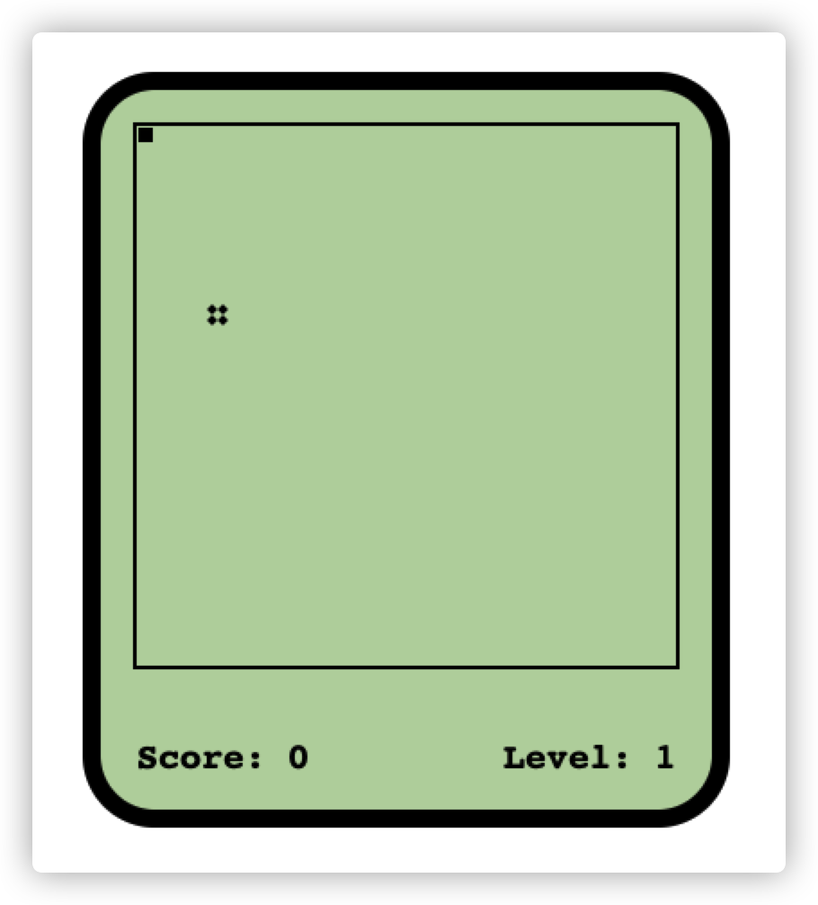

# 一个用ts实现的贪吃蛇demo

跟着[尚硅谷2021版TypeScript教程（李立超老师TS新课）](https://www.bilibili.com/video/BV1Xy4y1v7S2)一步步敲下来,感觉有不错收获的

主要学习了用`ts`的类实现功能，以及使用`webpack`打包`ts`代码和`css`代码

另外也写了两个笔记供参考[Webpack打包ts](./Webpack打包ts.md)和[Webpack打包css](./Webpack打包css.md)

# 项目的运行

```bash
# 下载
git clone https://github.com/jzhmcoo1/GreedySnakeByTS
# 安装依赖
npm install
# 开发环境运行
npm start
# 打包
npm run build
```

# 项目预览

